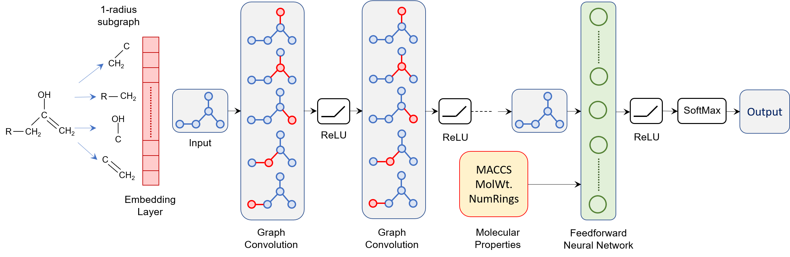

# A Deep Learning Architecture for Metabolic Pathway Prediction

This code is an implementation of our graph-convolutional network (GCN) and random forest (RF) classifiers for predicting one or many metabolic pathway classes for a query compound. 

